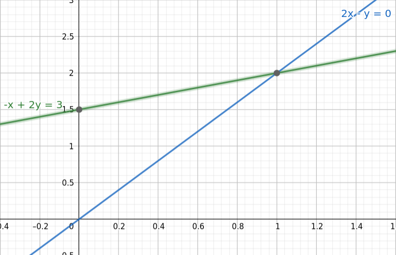
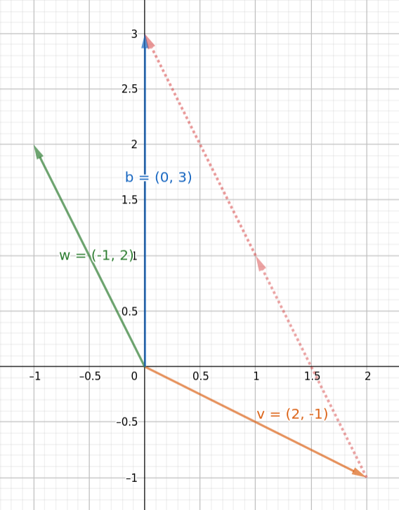

# Lecture 1
## Mentions
I think that nowadays in most of the current areas of research in computer science, math is central if you want to do something relevant. Linear Algebra is one of the math knowledge that a computer scientist should have. This article contains the basis of this subject, and what I'll mention is taken from the open course of [Linear Algebra by Gilbert Strange](https://ocw.mit.edu/courses/mathematics/18-06-linear-algebra-spring-2010/index.htm), one of the best courses you can find about these concepts.

## Some Applications
There many applications of Linear Algebra in computer science here some of them:\
1. **Machine Learning**: is the main topic in linear classifiers like SVM or in linear regression techniques like Least Squares;\
2. **Neural Network**: in some NNs like ELM is used the pseudoinversion of a matrix to calculate the weights for every neurons in the architecture;\
3. **Optimization**: the primary technique for solving linear programming is the simplex algorithm which is based on linear algebra.

## What is a matrix? What does it represent?
Let's suppose we have to resolve one of the most simplest system of equations, 2 equations in 2 unknowns:
$$2x - y = 0$$ 
$$-x + 2y = 3$$
We want therefore find the right x's and y's that resolve both equations in that system.\
A compact way to deal with such systems is using matrices:
$$ Ax = b \Rightarrow
\begin{bmatrix}
 2 & -1\\
-1 & 2
\end{bmatrix}
\begin{bmatrix}
x \\ 
y 
\end{bmatrix} = \begin{bmatrix}
0 \\
3 
\end{bmatrix}$$
In this equation **A** is the coefficients matrix, **x** is the vector of unknowns and **b** is the right-hand side vector.
We will first find the solution of this system without using directly matrix operations and then I'll tell you why matrix are necessary to deal with more complex system.

## Row Picture
As this name suggest let's pick each rows of the system and plot the line that each row represent in a Cartesian space:\

In a two-dimensional space each row is a line and if they are independent like these, they meet in a point.
From this image is easy to visualize that the unique solution of that system is $x=1$ and $y=2$, the point that lies at the intersection of the two lines.\
In fact if we substitute this answer in the system we obtain:
$$2\cdot1 -2 = 0$$
$$-1 + 2 \cdot 2 = 3$$

## Column Picture
Another way to get the solution and visualize graphically the system is picking each columns of the system and plot them as vectors in a Cartesian space:\
\
In this image we have the vector $v =\begin{bmatrix} 2 \\ -1 \end{bmatrix}$ with the 2 coefficients of x in the system and $w =\begin{bmatrix} -1 \\ 2 \end{bmatrix}$ for the coefficients of y.\
What we got is this equation:\
$$ x \cdot \begin{bmatrix} 2 \\ -1 \end{bmatrix} + y \cdot \begin{bmatrix} -1 \\ 2 \end{bmatrix} = \begin{bmatrix} 0 \\ 3 \end{bmatrix}$$
And we want the right linear combination of the vectors **v** and **w** to obtain the vector **b**. The solution obviously is the same: $x=1, y=2$ and it is shown graphically with the two vectors in red, equal to *w*, that starting from **v** arrive at **b**.

## Why use matrices?
From this discussion, it may seem that matrices are not needed to solve any system of equations, because we could do that graphically. Yes, but no. Let's imagine only 1 additional dimension like small systems of 3 equations in 3 unknowns. In the Row Picture we have to draw 3 different planes and if they are independent two of those will meet on a line and with the third one the intersection will be only a single point: the point that solves the system.\
The same reasoning could be applied also to the Column Picture. It's difficult to represent multidimensional vectors and find their correct linear combination to get the right-hand side. 

## Conclusion
As the dimensionality increases, we get systems that can be useful in practice, but we lose the possibility of being able to visualize them. Therefore, we need compact representations of multi-dimensional systems of equations and we need all the properties that matrices have to resolve significant problems.

If I wrote everything I have learned over the years on linear algebra this article would become eternal and probably no one would come to the end. This is why I decided to divide what I think are the basic knowledge about this topic into several lectures, like Gilbert Strange did.

*Author: Lorenzo Sciandra*